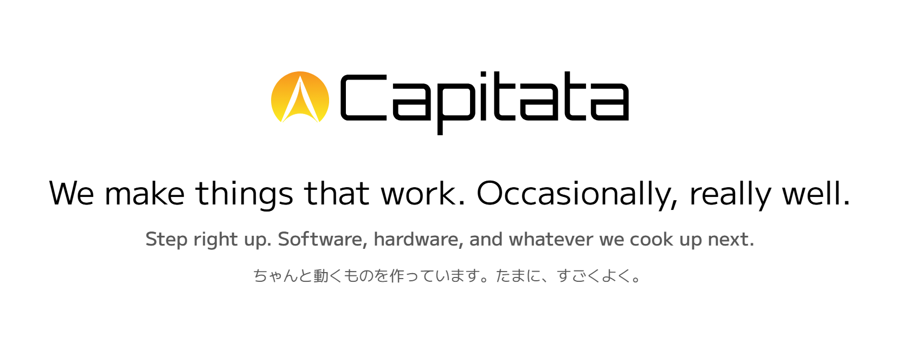
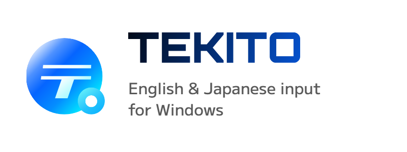
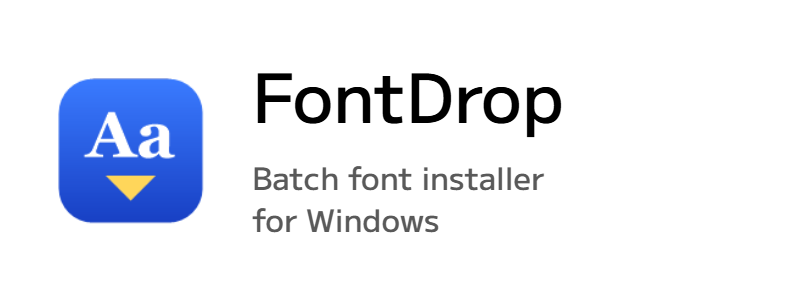

  <a href="https://capitata.dev">
    <picture>
      <source media="(prefers-color-scheme: dark)" srcset="assets-v2/hero-dark.png">
      
    </picture>
  </a>

  <a href="https://github.com/Canta360/tekito"><picture><source media="(prefers-color-scheme: dark)" srcset="assets-v2/card-tekito-dark.png"></picture></a> <a href="https://github.com/Canta360/FontDrop"><picture><source media="(prefers-color-scheme: dark)" srcset="assets-v2/card-fontdrop-dark.png"></picture></a>
   
  <a href="https://github.com/Canta360/tekito/releases"><picture><source media="(prefers-color-scheme: dark)" srcset="assets-v2/btn-download-dark.png"></picture></a><a href="https://github.com/Canta360/tekito"><picture><source media="(prefers-color-scheme: dark)" srcset="assets-v2/btn-repo-dark.png"></picture></a><a href="https://github.com/Canta360/FontDrop/releases"><picture><source media="(prefers-color-scheme: dark)" srcset="assets-v2/btn-download-dark.png"></picture></a><a href="https://github.com/Canta360/FontDrop"><picture><source media="(prefers-color-scheme: dark)" srcset="assets-v2/btn-repo-dark.png"></picture></a>

